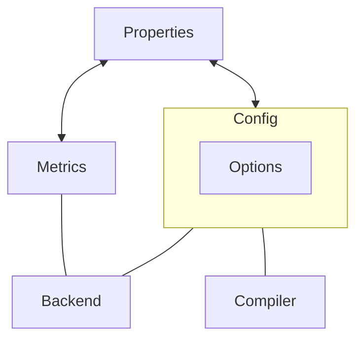
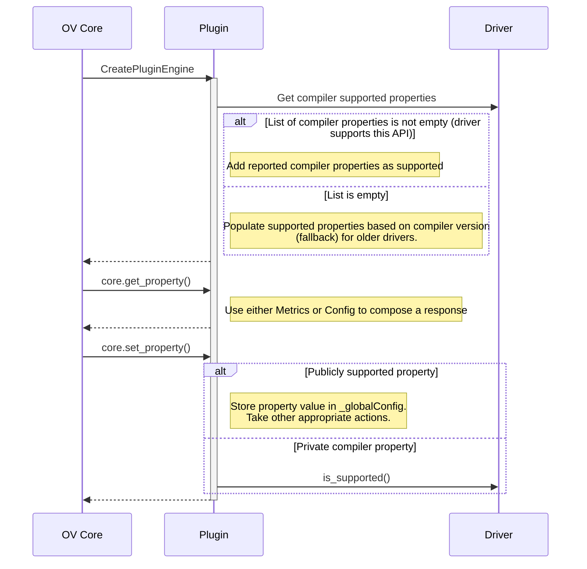

# How to add or remove NPU support for a specific property

Properties can be used to query and adjust the behavior of the NPU plugin itself or various parameters that control model compilation and execution.  

## Supported properties

NPU Plugin supports both a subset of openvino properties defined in [this](https://github.com/openvinotoolkit/openvino/blob/master/src/inference/include/openvino/runtime/properties.hpp) header and an NPU specific list of properties defined in [this](https://github.com/openvinotoolkit/openvino/blob/master/src/inference/include/openvino/runtime/intel_npu/properties.hpp) header.<br/>
The actual list of properties supported at any given time by the NPU Plugin depends on the NPU driver installed on the system. NPU Plugin will not return as supported a property that depends on the driver and is not also supported by the current driver. <br/>

* The list of NPU supported properties can be queried using:

```
core.get_property("NPU", ov::supported_properties)
```

This list is dynamic and it depends on the driver version and even on other properties already configured.

* A supported property can be set for the entire plugin scope ( for all future model compilation requests) using:
```
core.set_property("NPU", {{property.name(), <property_value>}})
```

* Alternatively, properties can be set only for a specific model during compilation using:
```
core.compile_model("NPU", model, {{property.name(), <property_value>}})
```

During the model compilation, the plugin will merge local properties with previously set global properties.

## Internal implementation of properties

Properties act as an interface between the OpenVINO API and:
* The current state of the global Config
* A set of read only parameters that can to be retrieved from the backend (Metrics)

A global Config is maintained internally by the plugin to control compiler argments, compiled_model behavior, inference requests, backends, etc.



## Config

The global config can only be updated through core.set_property() or through environment variables. <br/> 
Not all configs can be updated through environment variables. Can we fix this? <br/> 
Most of environment variables are usable only when NPU_DEVELOPER_BUILD=ON ( DEBUG_CAPS=ON). <br/> 

### Options

Plugin must first register all supported options. Plugin can later only set a config value for a registered option. <br/> 
Options can be dynamically updated. Example: Change NPU_COMPILER_TYPE in the config -> range of supported options will also change to include options supported by the active compiler.

## Metrics

"Metrics" is an internal interface used to query various backend parameters that depend on the level zero extension and driver versions.

## Sequence



## How to add support for a new property?

* Define the option in options.hpp
* Define the property either in the NPU header or in the OpenVINO common header
* Add it to the list in registerOptions() to be used only by the plugin
* Add it to _properties using:
    * TRY_REGISTER_SIMPLE_OPTION - based on _config.hasOpt()
    * REGISTER_SIMPLE_METRIC
    * REGISTER_CUSTOM_METRIC - in case it depends on something
* In case this is a compiler property:
    * Perform an OpenVINO update in the compiler repository
    * Register the option as supported
    * Implement compiler logic for this property

## Plugin support for private compiler properties

Applications should generally use only properties that are reported by the plugin in the list of supported properties. <br/>
Considering that NPU Plugin and NPU Compiler have different release cycles it is important for an already released NPU plugin to support unknown (private) compiler properties ( defined in a more recent OpenVINO version - not yet released).
TODO: explain limitation on datatype
In subsequent OpenVINO (plugin) releases this property will be marked as supported.

## Backward/forward compatibility scenarios

Property supported in (newer) compiler but not supported in the plugin: plugin will not try to register it, it can only be used as a private compiler property. <br/>
Property supported in plugin but not supported in compiler: plugin will try to register it but failed to do so since it is not part of the list of compiler supported properties.

## How to remove support for a compiler property?

Removing compiler support for a property might impact already released applications. <br/> 
Once the option is no longer registered in VCL, it will no longer be part of the list of supported options provided by the driver to the plugin, thus it will no longer be listed by the plugin as a supported property. <br/> 
In case applications set this property without checking the list of supported properties, the compiler might return an error during model compilation. <br/> 
Removing an option from OpenVINO will force the compiler to remove support for that option, thus impacting already released applications. Is it ok to remove properties, but not options?